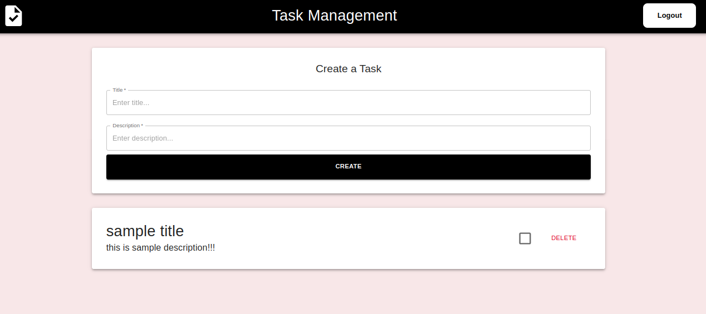
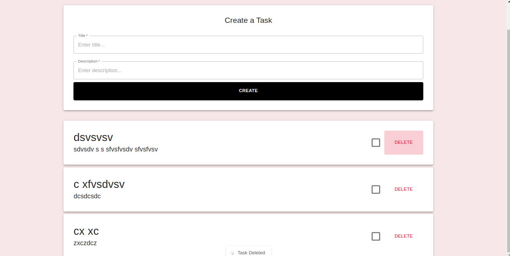
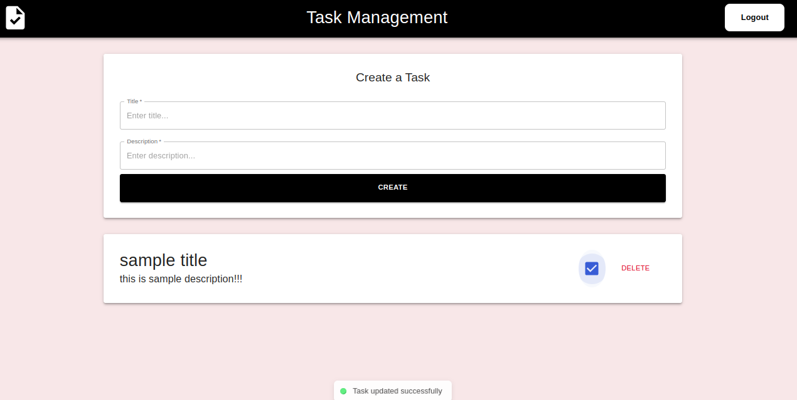

# Task Management Application

This is a full-stack Task Management Application built using **React (MUI)** for the frontend and **Node.js (Express)** with **MongoDB** for the backend.

---

## 🚀 Features

- Create new tasks with title and description
- Mark tasks as completed/uncompleted
- Delete tasks
- Real-time state update (with RTK Query)
- Error handling with toast notifications

---

## 📸 Screenshots

### ➜ Create Task



### ➜ Task List



### ➜ Task Updated



---

## 🛠️ Tech Stack

### 💻 Frontend

- React.js
- MUI (Material UI)
- React Hot Toast
- RTK Query (Redux Toolkit Query)

### 🔧 Backend

- Node.js
- Express.js
- MongoDB (Mongoose)

---

## 🔧 Setup and Installation

1. **Clone the repository:**

   ```bash
   https://github.com/Imran00852/taskManagement-frontend.git
   ```

2. **Install dependencies:**

   ```bash
   npm install
   ```

3. **Setup environment variables:**

   - Create a `.env` file in the root directory and add:
     ```env
     MONGO_URI=your_mongodb_connection_string
     PORT=8080
     ```

4. **Run backend server:**

   ```bash
   npm run dev
   ```

5. **Run frontend:**

   ```bash
   npm start
   ```

6. **Visit the app:**
   ```bash
   http://localhost:5173
   ```

---

## 🔥 API Routes

### ➜ Create Task

```http
POST /tasks
```

**Body:**

```json
{
  "title": "Task Title",
  "description": "Task Description"
}
```

### ➜ Get All Tasks

```http
GET /tasks
```

### ➜ Update Task

```http
PUT /tasks/:id
```

**Body:**

```json
{
  "isCompleted": true
}
```

### ➜ Delete Task

```http
DELETE /tasks/:id
```

## 💪 Contributors

- **Your Name** _(github.com/imran00852)_

---
